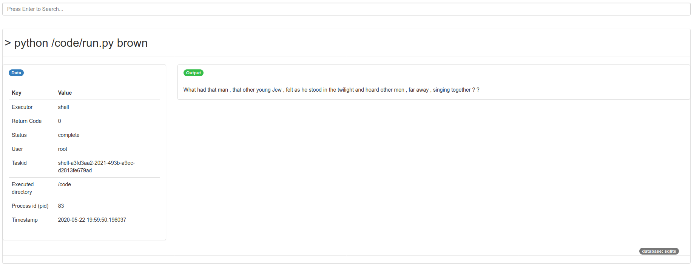

# nltk-docker

This basic container provides an install of [nltk](https://www.nltk.org/) alongside qme so we can
demonstrate how to run some set of scientific software commands within a container,
and keep them handy via a QueueMe dashboard. Specifically, in [script.py](script.py)
we load a user selected nltk corpus, randomly choose a file from it, and then a sentence.
We print the sentence as our result to the terminal.

```python
#!/usr/bin/env python

import nltk
from nltk.corpus import brown, gutenberg, reuters, inaugural

import random
import sys


def main(corpus):
    lookup = {
        "brown": brown,
        "gutenberg": gutenberg,
        "reuters": reuters,
        "inaugural": inaugural,
    }
    if corpus not in lookup:
        sys.exit(f"Cannot find {corpus} in lookup. Choose from {list(lookup.keys())}")

    # Get the corpus, choose a random file
    corpus = lookup[corpus]
    fileid = random.choice(corpus.fileids())

    # Randomly select a sentence
    sentence = random.choice(list(corpus.sents(fileid)))
    print(" ".join(sentence))

...
```

This is just an example - you could imagine instead doing something similar for
a scientific pipeline.

## 1. Build

Let's build the base container for the orchestration. This is built from
the [Dockerfile](Dockerfile) in this folder. It's a relatively simple Dockerfile -
we start with the qme base (has Python installed with QueueMe, you could do this on
 your own just as well):

```
FROM quay.io/vanessa/qme
LABEL MAINTAINER @vsoch
# docker build -t quay.io/vanessa/nltk-qme .
RUN pip install nltk && \
    mkdir ~/nltk_data && \
    mkdir ~/nltk_data/chunkers && \
    mkdir ~/nltk_data/corpora && \
    mkdir ~/nltk_data/taggers && \
    mkdir ~/nltk_data/tokenizers && \
    python -c "import nltk; nltk.download(['brown', 'gutenberg', 'reuters', 'inaugural'])"
EXPOSE 5000
WORKDIR /code
COPY ./script.py /code/run.py
```

And then to build:

```bash
$ docker build -t quay.io/vanessa/nltk-qme .
```

## 2. Start the container

Now let's start the container, in detached, and this will show us the web interface on port 5000.

```bash
$ docker run -d --rm -p 5000:5000 quay.io/vanessa/nltk-qme start
```
```bash
$ docker ps
CONTAINER ID        IMAGE                      COMMAND                  CREATED             STATUS              PORTS                    NAMES
047ceb72399f        quay.io/vanessa/nltk-qme   "/opt/conda/bin/qme …"   2 seconds ago       Up 1 second         0.0.0.0:5000->5000/tcp   dreamy_bhaskara
```

## 3. Run Commands

At this point you can open to [http://0.0.0.0:5000](http://0.0.0.0:5000) to see an empty dashboard.


Let's execute some commands to the container, specifically to run our custom nltk script. If we
run without context for QueueMe we would do:

```bash
$ docker exec dreamy_bhaskara python /code/run.py
Years ago when I asked her to put me in Social Security , so's I wouldn't have to be working now , Miss Julia threatened to fire me -- all because it would mean a few more dollars a year to her '' .
```
This is a randomly selected sentence from the brown nltk corpus.
We could ask for a specific corpus, all of the following would work.

```bash
docker exec dreamy_bhaskara python /code/run.py brown
docker exec dreamy_bhaskara python /code/run.py reuters
docker exec dreamy_bhaskara python /code/run.py inaugural
docker exec dreamy_bhaskara python /code/run.py gutenberg
```

That's great, but let's say we are running something that we want to be able to reproduce,
either by saving the commands, the output, or any metadata associated with them. We would simply
add the `qme run` prefix to our execution:

```bash
$ docker exec dreamy_bhaskara qme run python /code/run.py brown
Database: sqlite
[shell-a3fd3aa2-2021-493b-a9ec-d2813fe679ad][returncode: 0]
$ docker exec dreamy_bhaskara qme run python /code/run.py reuters
Database: sqlite
[shell-00e34881-e1b1-4d79-ab28-9de4843cbe94][returncode: 0]
$ docker exec dreamy_bhaskara qme run python /code/run.py inaugural
Database: sqlite
[shell-9080c457-b88f-4104-af8f-d720e387bd3a][returncode: 0]
$ docker exec dreamy_bhaskara qme run python /code/run.py gutenberg
Database: sqlite
[shell-ff6ad49a-7b05-4d46-9588-0435cbcde697][returncode: 0]
```

## 4. View your Queue

We can now open the browser again to see the dashboard is populated!


We can click any specific entry to see the full command, output, and other
metadata.



This is a basic shell command, so it collects the metadata that you see above.
However, remember the QueueMe has the ability to define custom executors that
can parse your commands in some special way, and even expose custom interfaces!
Please [open an issue](https://github.com/vsoch/qme/issues) if you would like
to request an executor. If you wanted to see this same dashboard on your command
line, or see the last qme run, you could easily do that too:

```bash
$ docker exec dreamy_bhaskara qme get
Database: sqlite
{
    "executor": "shell",
    "uid": "shell-9080c457-b88f-4104-af8f-d720e387bd3a",
    "data": {
        "pwd": "/code",
        "user": "root",
        "timestamp": "2020-05-22 19:59:51.428268",
        "output": [
            "If we fail , the cause of free self - government throughout the world will rock to its foundations , and therefore our responsibility is heavy , to ourselves , to the world as it is today , and to the generations yet unborn .\n"
        ],
        "error": [],
        "returncode": 0,
        "pid": 95,
        "cmd": [
            "python",
            "/code/run.py",
            "inaugural"
        ],
        "status": "complete"
    },
    "command": "python /code/run.py inaugural"
}
```
```bash
$ docker exec dreamy_bhaskara qme ls
Database: sqlite
1  shell-a3fd3aa2-2021-493b-a9ec-d2813fe679ad	python /code/run.py brown
2  shell-00e34881-e1b1-4d79-ab28-9de4843cbe94	python /code/run.py reuters
3  shell-9080c457-b88f-4104-af8f-d720e387bd3a	python /code/run.py inaugural
4  shell-ff6ad49a-7b05-4d46-9588-0435cbcde697	python /code/run.py gutenberg
```

Finally, since the database is stored inside the container, it won't persist when
you stop the container. You should either create a volume, bind a folder to your
host, or use a Singularity container that has more seamless interaction with
the host.

## Advanced
You could use docker-compose orchestration to easily expose a port for the qme dashboard to keep track of commands.
You could also either maintain the database for the docker session, bind it to the host, or use Singularity so it is more seamless.
