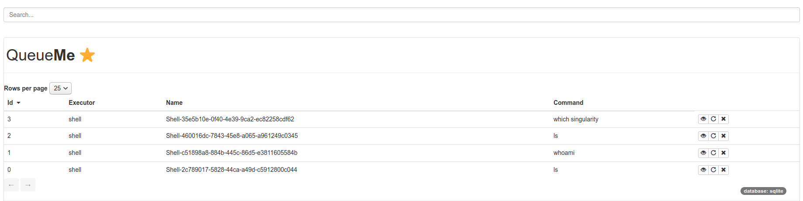
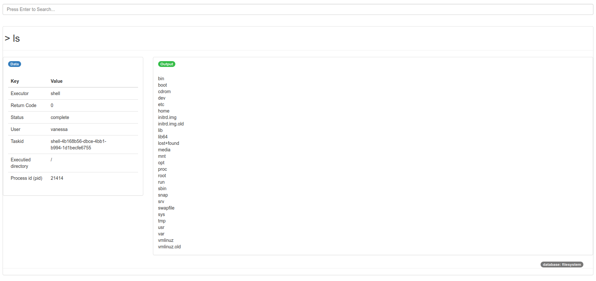
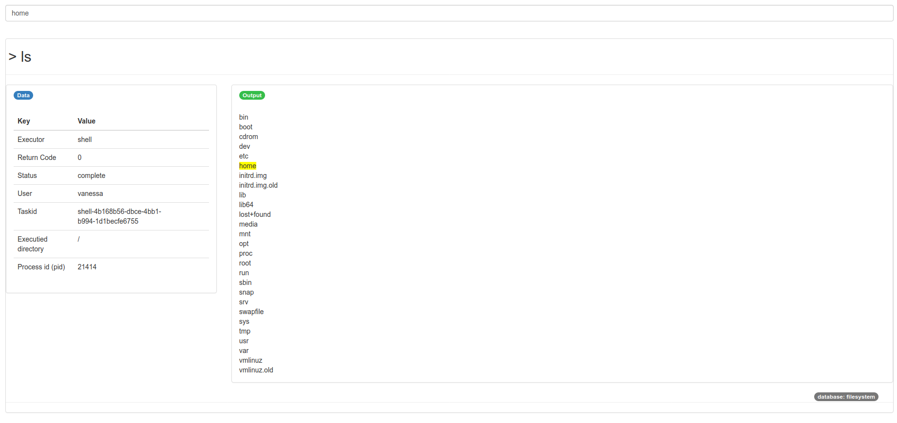

## Summary

Researchers often interact with multiple tools during a day's work, including
but not limited to a set of standard GNU utils commands in a terminal [@gnuutils],
tools to query or download data [@datalad], or to interact with remote resources.
While it's customary for a researcher to become familiar enough with the command line,
searching through history [@history], or executing commands to a specific tool,
it's often challenging to have an organized history of commands run, including not
just the commands themselves, but also output, return codes, and other metadata
associated with each particular command. While a set of instructions might be
written into a Linux container [@docker, @singularity], this is not the correct
level of abstraction for the researcher who more likely needs an interactive
and flexible way to run, inspect, and update tasks. "QueueMe" [@qme] (or on the command line, qme) 
is a jobs queue and dashboard generation tool that aims to fill this niche.
QueueMe comes with a set of executors (entities that run jobs) that can
take any generic command, and match it to the correct backend to handle
running the job, collecting appropriate metadata, and issuing follow up actions.
A database backend, customized to the user's liking (filesystem, sqlite, to relational)
stores tasks for further inspection, update, or simply as a record of commands run.
QueueMe can be interacted with on the command line, or if desired, via an interactive web dashboard.

## Design

The basic workflow of QueueMe looks like the following:

```
                                    +-------+
                                    |       |
                                +-->+ shell |
                                |   |       |
                                |   +-------+                   +--> qme clear...
                                |                               |
+------------+    +----------+  |   +-------+    +----------+   +--> qme get...
|            |    |          |  |   |       |    |          |   |
| qme run .. +--->+ executor +----->+ slurm |--->| database +---+--> qme ls...
|            |    |          |  |   |       |    |          |   |
+------------+    +----------+  |   +-------+    +----------+   +--> qme rerun...
                                |       .                       |
                                |       .                       +--> qme search...
                                |   +-------+                   |
                                |   |       |                   +--> qme start...
                                +-->+ other |
                                    |       |
                                    +-------+
```

In the above diagram, we start with a qme run command, and it get's parsed by a particular
executor (e.g., slurm, shell, or other). The executor interacts with our database of choice
(filesystem, sqlite, mysql, or postgres) to save custom metadata for the command (e.g,
output, error, return code, present working directory, etc. for shell). The
user can then query qme to get, list, re-run, or clear a set of tasks or a particular task result, 
or generally list all tasks or open an interactive web interface to do the same.

The dashboard will show a table of results:



where the user can click one to see it's executor-specific web interface (for example,
a shell executor is optimized to show output, error, metadata, and the command at
the top:



and then makes it easy search output. A search box at the top will highlight results
in yellow that match the user search:



The interface pages are automatically updated (without refreshing the page) by way of
using web sockets [@websockets], 
along with Vue.js [@Vue.js] 
and Flask [@Flask].

## Concepts

The following concepts might not be specific to qme, but are defined as the following
in the context of qme:

**executor**

An executor is the controller that will handle parsing of a command line (terminal)
command, and ensuring that:

 - appropriate metadata is collected 
 - the command is run
 - relevant actions are exposed

**dashboard**

Is a Flask application that comes with qme, exposed via `qme start`, that provides
an table to manage and otherwise interact with tasks.

**database**

A database is the backend database used by QME to store tasks. The default
database is the filesystem, which is good to briefly test out QueueMe but
not use extensively. For most use cases, sqlite is recommended as it supports display
or more information and easier search. The user can easily customize the database
backend as follows:

```bash
$ pip install -e .[all]         # local install from repository
$ pip install -e qme[all]       # install from pypi
$ qme config --database sqlite
```

## Commands

QueueMe includes several commands, which will be discussed in this section.

### Run

The most basic function for QueueMe to do is run a command (one that is executed and has error,
output, and a return code) like the following:

```bash
$ qme run ls $PWD
INFO:qme.main:Database: filesystem
INFO:qme.main:[shell-97b17444-704a-4bb7-81e0-43149dd4af58][returncode: 0]
```
The command is so quick that it returns the result immediately. In the above,
we see the executor (shell) along with the unique id (the following uuid), 
and the full command (to list the expanded $PWD) and the return code 0. 
The user can add a message (annotation) to store with the task and be used
for search as follows:

```bash
$ qme -m "This is a listing for the thing" run ls $PWD
```

In the above cases, we can tell that the shell executor was used based on the
prefix of the taskid starting with "shell." If we ran an sbatch [@slurm] command,
for example, the slurm executor would detect this and be used instead.

### Get 

After we run a command and know the identifier (`shell-97b17444-704a-4bb7-81e0-43149dd4af58` for the above)
we likely want to get a summary of it. We can do that with `qme get`, which 
expects a task id.

```bash
INFO:qme.main:Database: filesystem
{
    "executor": "shell",
    "uid": "shell-97b17444-704a-4bb7-81e0-43149dd4af58",
    "command": "ls /home/vanessa/Desktop/Code/qme",
    "data": {
        "pwd": "/home/vanessa/Desktop/Code/qme",
        "user": "vanessa",
        "timestamp": "2020-06-03 16:34:43.107176",
        "output": [
            "build\n",
            "CHANGELOG.md\n",
            "dist\n",
            "Dockerfile\n",
            "docs\n",
            "examples\n",
            "LICENSE\n",
            "MANIFEST.in\n",
            "paper\n",
            "qme\n",
            "qme.egg-info\n",
            "README.md\n",
            "setup.cfg\n",
            "setup.py\n",
            "tests\n"
        ],
        "error": [],
        "returncode": 0,
        "pid": 20852,
        "cmd": [
            "ls",
            "/home/vanessa/Desktop/Code/qme"
        ],
        "status": "complete"
    }
}
```

We can get the last task run (the same as above) just with qme get.

```bash
$ qme get
```

It will retrieve the last updated entry in the database across executors.

### List

For the command line, the user can easily list tasks. For the filesystem database,
since we would need to read in several json files, the listing just shows the
task ids. 

```bash
$ qme ls
DATABASE: filesystem
1  shell-7a2f5e23-27ef-49eb-a6a6-896ddc690117
2  shell-84f90411-a53e-4d40-92b0-706e5ddfa3b9
3  shell-5c61ce2b-988e-44fa-8678-a9704ca11b1a
4  shell-542e11ef-a1d1-47ce-90a7-40fc7829d29f
5  shell-0f85a77f-f442-46b1-88b1-7d55303b2119
6  shell-5a9e4413-b25d-4dca-826f-f9f8b27abf50
7  shell-2e65e814-388d-4617-bf89-ef307ba6fa40
8  shell-c07e9279-eee7-4778-9212-4ac617a6082e
9  shell-bcaae4db-2970-4674-9800-376c891c1454
10 shell-38307314-9825-435b-8fb6-6d37b3427a7b
11 shell-ad239488-2a27-47b9-8225-da227625e913
```

However, if we update our database to be sqlite:

```bash
$ qme config --database sqlite
```

And then run several tasks, the listing will show commands alongside the tasks:

```bash
$ qme ls
INFO:qme.main:Database: sqlite
1  shell-38f2535a-e38f-4bc4-8667-9c43726b1e7e	ls
2  shell-de58f61b-81da-467c-981c-497f7ae8556b	echo Hello Moto
3  shell-c231699a-4c3e-43f0-961f-2829d16d588c	echo Hello Another Moto
```

We could also easily specify to just list an executor of one type:

```bash
$ qme ls shell
```

### Clear

If the user want to delete a task, the command "clear" can be used with the taskid:

```bash
$ qme clear shell-84f90411-a53e-4d40-92b0-706e5ddfa3b9
DATABASE: filesystem
This will delete task shell-84f90411-a53e-4d40-92b0-706e5ddfa3b9, are you sure? [n]|y: y
shell-84f90411-a53e-4d40-92b0-706e5ddfa3b9 has been removed.
```

The user can also remove an entire executor:

```bash
$ qme clear shell
DATABASE: filesystem
This will delete all executor shell tasks, are you sure? [n]|y: n
```

or all tasks in the database:

```bash
$ qme clear
DATABASE: filesystem
This will delete all tasks, are you sure? [n]|y: n
```

Each time the user is asked for a confirmation first, in case the command was 
run in error.

### Rerun

The user can re-run any task, also based on it's taskid. A re-run will load the 
previous command, change to a different directory (if set) and then
re-run the command. The result will be stored under the  (updated) taskid.
Here is a quick example of showing an older task and then using re-run, 
and showing that the task is updated. First, here is the original task:

```bash
$ qme get shell-9817744f-77ae-4e8b-ac2e-2e326bc11d7b
{
    "executor": "shell",
    "uid": "shell-9817744f-77ae-4e8b-ac2e-2e326bc11d7b",
    "data": {
        "pwd": "/home/vanessa/Desktop/Code/qme",
        "user": "vanessa",
        "timestamp": "2020-05-29 14:24:10.050944",
        "message": "I am echoing a thing",
        "output": [
            "hello\n"
        ],
        "error": [],
        "returncode": 0,
        "pid": 30157,
        "cmd": [
            "echo",
            "hello"
        ],
        "status": "complete"
    },
    "command": "echo hello"
}
```

Now we re-run it:

```bash
$ qme rerun shell-9817744f-77ae-4e8b-ac2e-2e326bc11d7b
```

And finally, we see that the task is updated.

```bash
INFO:qme.main:Database: sqlite
{
    "executor": "shell",
    "uid": "shell-9817744f-77ae-4e8b-ac2e-2e326bc11d7b",
    "data": {
        "pwd": "/home/vanessa/Desktop/Code/qme",
        "user": "vanessa",
        "timestamp": "2020-06-03 16:43:45.717093",
        "message": "I am echoing a thing",
        "output": [
            "hello\n"
        ],
        "error": [],
        "returncode": 0,
        "pid": 21029,
        "cmd": [
            "echo",
            "hello"
        ],
        "status": "complete"
    },
    "command": "echo hello"
}
```

The user can also rerun the last touched task without needing to specify the identifier.

```bash
$ qme rerun
```

And akin to run, if the user wants to add a message (to update the existing) that is possible too:

```bash
qme -m "This is a listing for the thing" rerun
```

### Search

It's often the case that we want to search our previously run tasks, either the message
annotation, the command, or general associated metadata. That is possible with "search": 

```bash
$ qme run echo Hello Moto
$ qme run echo Hello Another Moto
```

For a sanity check, we can list all tasks and use grep [@grep] to search for the term:

```bash
$ qme ls | grep Moto
2  shell-de58f61b-81da-467c-981c-497f7ae8556b	echo Hello Moto
3  shell-c231699a-4c3e-43f0-961f-2829d16d588c	echo Hello Another Moto
```

Instead, however, we can use `qme search`.

```bash
$ qme search moto
Database: sqlite
1  shell-de58f61b-81da-467c-981c-497f7ae8556b	2020-05-22 17:47:37	echo...
2  shell-c231699a-4c3e-43f0-961f-2829d16d588c	2020-05-22 17:47:45	echo...
```

Notice that the search is case insensitive. We get back the taskid (that is prefixed with
the executor) along with the timestamp and the command itself. Tasks with matches in
some part of the metadata (e.g., a string in the output or error) would be included too.
Since search takes advantage of using a relational (or sqlite) database,
the filesystem database is not supported.

### Start

The qme start command will open a web interface with an interactive table
for tasks. 

```bash
$ qme start
```

It can be run in debug mode

```bash
$ qme start --debug
```

or customized for the port or hostname

```bash
$ qme start --port 8000 --host 0.0.0.0
```

For each, the user can specify a particular action (e.g., delete or re-run)
or click on it for further details.

## Executors

As executor in the context of QuemeMe is a controller that will handle parsing of a command line (terminal)
command. Any executor must ensure that:

 - appropriate metadata is collected 
 - the command is run
 - relevant actions are exposed

This section will give an overall review of executors. For each described below,
there is custom metadata extracted depending on the executor, and templates can
be customized to render this metadata in the dashboard.

## Executors

### Base

Each executor exposes the following metadata:

 - **pwd**: the present working directory where the command was run
 - **command**: the command that was run
 - **user**: the user that ran the command
 - **status**: the status of the operation. Since most basic commands save the first time upon completion, the status is usually complete, however this is subject to change. This must be one of "complete" "cancelled" or "running" or None.

The only metadata shown on the table (front) page of the dashboard is these common attributes.

### Shell

The "shell" executor is the default that will take any command that doesn't match a previous
regular expression, and the executor will run the command, parse output and error streams, and then
provide a result object with the following metadata:

 - **output**: the output stream of running the command
 - **error**: the error stream of running the command
 - **returncode**: the returncode from running the command
 - **pid**: the pid of the child process.

This means that it doesn't have a specific match string or actions beyond the basic that are
provided for any command (delete, view, and re-run). The matching dashboard interface is thus
optimized to show and search this information, mainly the command and any output or error. An example shell run might look like:

```bash
$ qme run echo "hello moto"
```
```bash
$ qme get
Database: sqlite
{
    "executor": "shell",
    "uid": "shell-eab1fcff-d8b8-497a-bb7b-c758b23ff697",
    "data": {
        "pwd": "/home/vanessa/Desktop/Code/qme",
        "user": "vanessa",
        "timestamp": "2020-05-20 16:47:47.955877",
        "output": [
            "hello moto\n"
        ],
        "error": [],
        "returncode": 0,
        "command": [
            "echo",
            "hello moto"
        ],
        "status": "complete",
        "pid": 15048
    },
    "command": "echo hello moto"
}
```

There are no specific environment variables for shell, beyond the default, nor any actions.

### Slurm

The "slurm" [@slurm] executor is intended for using sbatch to run slurm jobs, sacct to check
on status, and scancel to cancel. Since the slurm executor is a subclass of shell
it exposes the same metadata. 

```bash
$ qme get
Database: sqlite
{
    "executor": "slurm",
    "uid": "slurm-02eecdcd-a6b2-4055-8fad-c94e846a0f26",
    "data": {
        "pwd": "/home/users/vsochat",
        "user": "vsochat",
        "timestamp": "2020-05-20 16:24:01.216868",
        "output": [
            "Submitted batch job 907484\n"
        ],
        "error": [],
        "returncode": 0,
        "command": [
            "sbatch",
            "--partition",
            "owners",
            "--time",
            "00:00:10",
            "run_job.sh"
        ],
        "status": "complete",
        "pid": 156932
    },
    "command": "sbatch --partition owners --time 00:00:10 run_job.sh"
}
```

#### Actions

Actions include the following:

  - **status**: Get a status dictionary, with a default format string set by QueueMe
  - **output**: Get the output file output, if it exists. `--out` can be set, or left unset.
  - **error**: Get the error file output, if it exists. `--err` can be set, or leave unset. 
  - **cancel**: cancel a job that was run with scancel

For output and error files, the user can either leave unset (to use a default) or set `--out` or `--err` to
be read by QueueMe. SBATCH directives are not currently parsed. Here are quick examples of using
running executor actions for the job we just ran above. Since it's the last run task, we don't
need to specify the taskid, akin to `qme get` without one.

**status**

```bash
$ qme exec status
Database: sqlite
{'jobid': '941170', 'jobname': 'run_job.sh', 'partition': 'owners', 'alloccpus': '1', 'elapsed': '00:00:06', 'state': 'COMPLETED', 'exitcode': '0:0'}
```

**output** and **error**

```bash
$ qme exec output
Database: sqlite
HELLO WORLD
```

**cancel**

```bash
$ qme exec cancel
```

## Discussion

QueueMe addresses the problem of reproducibility of commands in that it can wrap
any terminal command and extract complete metadata for inspection, update, or
visualization. It fills a niche in a suite of reproducibility tools to manage
tasks that is not currently filled. In that a user or contributor can define
any kind of custom executor to interact with everything from local resources
to remote application programming interfaces (APIs), QueueMe has great potential
to be useful across many kinds of research.

# References
